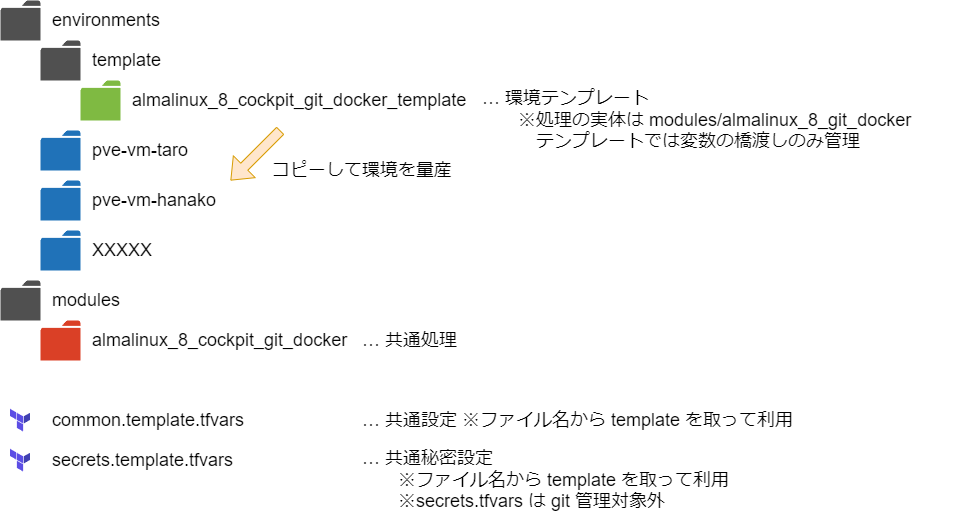

# terraform_proxmox_ve_example1

## 概要
* Terraform を使って Proxmox VE に QEMU の VM インスタンスを立ち上げる
* Cloud-init を使う
* proxmox_cloud_init_disk を使う 
* 簡単に環境を量産する
* リソース定義の共通化は Modules で実施  
  ※ Workspace は切り替え忘れの事故や環境の構成が一見してわからない懸念があったので不採用

Proxmox Virtual Environment  
https://www.proxmox.com/en/proxmox-virtual-environment/overview  

Terraform  
https://www.terraform.io/  

Terraform provider plugin for Proxmox  
https://github.com/Telmate/terraform-provider-proxmox  

Terraform Registory - Telmate/proxmox  
https://registry.terraform.io/providers/Telmate/proxmox/latest  

Proxmox Provider の使い方  
https://registry.terraform.io/providers/Telmate/proxmox/latest/docs  

Terraform × cloud-init で VM のセットアップをいい感じにする話  
https://speakerdeck.com/yusuke427/terraform-x-cloud-init-de-vm-nosetutoatupuwoiigan-zinisuruhua  

## 環境
* Proxmox VE 8.2.2
* Terraform v1.9.8 on windows_amd64
* Terraform provider plugin for Proxmox 3.0.1-rc4

## ファイル・フォルダ構成


## 利用方法

### 前提
* [AlmaLinux 8 の汎用クラウド(Cloud-init)イメージをテンプレートに登録](https://github.com/Tobotobo/proxmox-ve_qemu_almalinux-8/blob/main/docs/001_create_template_almalinux_8_cloud_image.md) が実施済みであること
* [操作対象の Proxmox VE に Terraform 用のユーザーとロールを作成](#操作対象の-proxmox-ve-に-terraform-用のユーザーとロールを作成) が実施済みであること

### 共通設定
* common.template.tfvars をコピーし common.tfvars にリネーム
* common.tfvars を適当に設定
* secrets.template.tfvars をコピーし secrets.tfvars にリネーム
* secrets.tfvars を適当に設定

### 環境作成

* enviroments/template/almalinux_8_git_docker_template を enviroments フォルダ内にコピー
* フォルダ名を適当に変更 ※例:pve-vm-taro
* フォルダ内の terraform.template.tfvars を terraform.tfvars にリネーム
* terraform.tfvars を適当に設定
* フォルダ内で `./cmd/terraform-init.bat` を実行
* フォルダ内で `./cmd/terraform-plan.bat"` を実行
* フォルダ内で `./cmd/terraform-apply.bat` を実行

### 破棄する場合  
* フォルダ内で `./cmd/terraform-destroy.bat` を実行 

### Cockpit の利用

https://<VMのホスト名>.local:9090/  
例）https://pve-vm-taro.local:9090/  

※「この接続ではプライバシーが保護されません」という警告が表示される  
　→　[証明書をインストールして Copilot の SSL を有効にする](#証明書をインストールして-copilot-の-ssl-を有効にする) を実施するか、以下の操作を実施  
　　　・その警告画面の左下の「詳細設定」をクリック  
　　　・XXXXX にアクセスする (安全ではありません) をクリック  

### 証明書をインストールして Copilot の SSL を有効にする
対象: Chrome、Edge　※他のブラウザは別の操作が必要かも

管理者権限で powershell を起動し以下を実行  
※scp の接続情報は要変更
```ps1
$tempFile = [System.IO.Path]::GetTempFileName()
scp taro@pve-vm-taro:/etc/cockpit/ws-certs.d/0-self-signed-ca.pem "$tempFile"
certutil -addstore "Root" "$tempFile"
```

以下のようにストアに追加されれば OK
```ps1
> certutil -addstore "Root" "$tempFile"
Root "信頼されたルート証明機関"
署名は公開キーと一致します
証明書 "pve-vm-taro.local" がストアに追加されました。
CertUtil: -addstore コマンドは正常に完了しました。
```

ブラウザを再起動する  
※うまく反映されない場合は端末ごと再起動

## 詳細

### 操作対象の Proxmox VE に Terraform 用のユーザーとロールを作成

※`Datastore.Allocate` を追加。cloud-init の config ファイルを local の iso イメージとして作成した際、削除できなくなるため
```
user_pass="terraform"
pveum role add TerraformProv -privs " \
    Datastore.AllocateSpace \
    Datastore.AllocateTemplate \
    Datastore.Audit \
    Datastore.Allocate \
    Pool.Allocate \
    Sys.Audit \
    Sys.Console \
    Sys.Modify \
    VM.Allocate \
    VM.Audit \
    VM.Clone \
    VM.Config.CDROM \
    VM.Config.Cloudinit \
    VM.Config.CPU \
    VM.Config.Disk \
    VM.Config.HWType \
    VM.Config.Memory \
    VM.Config.Network \
    VM.Config.Options \
    VM.Migrate \
    VM.Monitor \
    VM.PowerMgmt \
    SDN.Use \
    "
pveum user add terraform-prov@pve --password ${user_pass}
pveum aclmod / -user terraform-prov@pve -role TerraformProv
```

### Cloud-Init 設定フロー図


### 変更したディスクサイズを反映
一度インスタンスを作成した後に、terraform.tfvars の vm_disk_size を変更して apply しても、  
以下の作業を実施しないと OS 側からは認識されないので注意

* `sudo fdisk /dev/sda` を実行
* `p` コマンドでパーティションの状態を確認  
  ※以下は `/dev/sda4` のサイズを変更する場合
* `d` コマンドを入力し、削除するパーティション番号に `4` を指定して `/dev/sda4` を削除  
  ※この操作はパーティションのエントリのみ削除され、データは保持される
* `n` コマンドを入力し、案内に従って諸々指定するが基本的に既定値でよい。ただし、最後の「署名を削除しますか？ [Y]es/[N]o: 」は必ず `N` を指定すること  
  ※以下を参考(20GB->30GB)
  ```
  コマンド (m でヘルプ): n
  パーティション番号 (4-128, 既定値 4):  
  最初のセクタ (2510848-62914526, 既定値 2510848): 
  最終セクタ, +セクタ番号 または +サイズ{K,M,G,T,P} (2510848-62914526, 既定値 62914526): 

  新しいパーティション 4 をタイプ Linux filesystem、サイズ 28.8 GiB で作成しました。
  パーティション #4 には xfs 署名が書き込まれています。

  署名を削除しますか？ [Y]es/[N]o: N 　　←★必ず N を指定！
  ```
* VM を再起動
* 再起動後 `sudo xfs_growfs /` を実行
* `df -H` でサイズが増えていることを確認